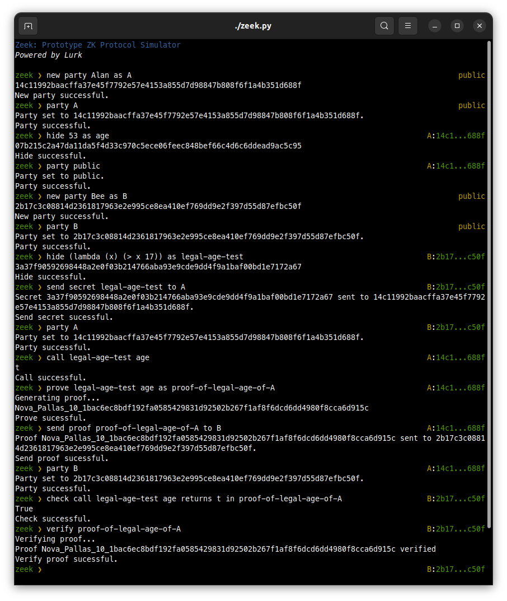

# Zeek: Prototype Zero Knowledge Protocol Simulator

`Zeek` implements a multiparty model [^MPC] on top of [Lurk](http://lurk-lang.org), a Zero Knowledge (ZK) programming language. 
In a ZK protocol, there are usually two parties: the prover and the verifier. The prover wishes to convince the verifier that
some information has a certain property without disclosing the actual information. Lurk is the programming language that allows for
creating such a (ZK) proof and `Zeek` allows for diffident parties to assume either the role of prover or verifier depending on the
state of the protocol.

`Zeek` has many commands to support this multiparty model on top of Lurk. 
One may choose to be the prover, the verifier or someone in the public.
Once a party is chosen, some commands may or may not be available. For
instance, a public party may not `hide` a secret but it may `verify`
proof and `check` that a given call yields a certain value in a given
proof.

`Zeek` is still WIP. Proper documentation will follow. The code is quite
simple though and one may like to inspect it and play with it. Many
nice developments are foreseen, such as integration with the Ethereum blockchain. Stay tuned!
    
Run it simply as `./zeek.py`.

[^MPC]: Even though the intention here is to allow for privacy among
    different parties, this work is not related with the [Multiparty
    Computation](https://en.wikipedia.org/wiki/Secure_multi-party_computation)
    field in cryptography. Thanks to Eduardo Morais for pointing this
    out to me!


## Examples

Meet our heroes: Zeek, the ZK protocol guy, Alan aka. A, and Bee aka. B. But you may add as many heroes as you like!

| Zeek 01                        | Zeek 02                         |
| ------------------------------ | ------------------------------- |
| |  |


### Legal age

One of the simplest examples one may execute in `Zeek` is the legal age verification. There are two parties, Alan and Bee. Alan hides his age as a secret and Bee discloses the test for legal age to Alan. Then Alan runs the test for legal age on his secret age and generates a proof of it. Alan sends the proof to Bee, who checks the proof being the result of the execution of the test of legal age with Alan's age as argument. Of course, the actual age is not known to Bee: only its hash. The following image shows the execution of this simple protocol.




### Credit score

Verification of a credit score is also a common example for ZK proofs. Here, one needs to prove to be eligible for a loan without disclosing one's assets. The credit report is where all the information necessary for a loan, and other financial transactions, live. The financial institution then provides the test that when applied to a credit report will answer yes or no to it, with yes the person has a good credit score and no otherwise.


## Install

Simply copy all Python 3 files in the repo wherever you want, and run `zeek.py` from there, 
or simply from the directory where you cloned the repo. If you do not have the right dependencies 
in you Python environment, `Zeek` will let you know.

`Zeek` scripts are implemented in Python 3 and it uses [lurk-rs](https://github.com/lurk-lab/lurk-rs).
Here are the commands to install Python [Python 3](http:://www.python.org), [Rust](https://www.rust-lang.org/) and [Lurk](http://lurk-lang.org), if you don't some of them,
but please refer to their own instructions in their web pages. Rust needs to be installed before lurk-rs since lurk-rs is implemented in Rust, 
1. To install Python 3, please check `https://www.python.org/downloads/`.
2. To install Rust:
```shell
curl --proto '=https' --tlsv1.2 -sSf https://sh.rustup.rs | sh
```
3. To install Lurk:
```shell
git clone git@github.com:lurk-lab/lurk-rs.git 
cd lurk-rs
cargo build 
cargo install --path .
```

## Basic concepts

_Zero Knowledge Protocol_. A ZK protocol is one where a party in the protocol may prove it has a certain secret without revealing it. A typical example is legal age verification: one may prove to be of legal age without disclosing one's age. Similarly, to prove to have a credit record that enables one to apply for a loan without disclosing one's assets.

_Hashes_. A hash value is a string of hexadecimal values used to represent secrets. They are usually calculated using cryptography algorithms such as those implemented in Lurk, the underlying cryptography system of `Zeek`. Certain commands in `Zeek` allow for the **labeling** of hashes, just to make it easier for someone to run a simulation. They do not reveal any information about a secret or proof. 

_A multiparty model_. A typical scenario in a ZK proof involves a couple of parties: the prover, who generates a ZK proof, and the verifier, who checks the proof. In a ZK protocol there could be many parties, each assuming either the role of prover or the role of the verifier in different points of the protocol's execution.

_Secrets_. A secret is any piece of information that becomes hidden behind a hash. In `Zeek` it can be any Lurk data. However, in the current version of `Zeek`, certain commands need to know if the value being hidden is a Lurk table or a Lurk function. These constraints will disappear in the future.

_Calling functions_. It's possible to execute function calls in `Zeek`. However, it assumes that the argument hashes represent a function and its data in a call.

_Proofs_. A proof can be generate about a given call. And it can be later shared with other parties without revealing the values in the call inside the proof. One only needs the proof and the hashes (not their values!) to check that a given proof is actually about some call returning some value.

_Sending secrets and proofs from one party to another_. Within this multiparty model, parties may trust each other by sending secrets and proofs to each other. Once a secret or  proof is shared, the receiver may reveal the secret's value and inspect the proof. 

## Commands

- Command `call <test> <value>` invokes a function hidden (with the precise semantics of `hide` in [Lurk](http://lurl-lang.org)) in a hash labeled `test` using the hash labeled `value` as argument. Parameters `test` and `value` may  be hashes instead of labels. 
  Even though one can hide any Lurk value using `Zeek`, at the moment it expects `test` to label a hash encoding a predicate.

- Command `check call <test> <value> returns <output> in <proof_key>` check if `call <test> <value>`, as described in the help message for `call`, returns `<output>` in the proof labeled (or with hash) `<proof_key>`. The reason why this command exists is because one may wish to check if a given proof is indeed about a given claim (the call) yielding a given value (`<output>`).

- Command `exit` terminates the current session. This command also saves the labels declared in the current session in the file `<zeek_dir>/.zeek/labels.json`.

- Command `hash hide <value>` hides `<value>` behind a hash without creating a label for it. 

- Command `hash new party <value>` creates a new party which will be represented in the system by the resulting hash. No label is created for it.

- Command `hash prove <test> <value>` creates a proof for `call <test> <value>`. No label is created for the resulting proof key.

- Command `help` returns this text.

- Command `hide <value> as <label>` hides `<value >` behind a hash and created a label for the returned hash.

- Command `with <file> hide table as <label>` hides the Lurk table (essentially a list of pairs) in `<file>` behind a hash and assigns `<label>` to the returned hash.

- Command `with <file> hide function <function> as <label>` loads the Lurk function(s) in `<file>` and hides function `<function>` behind a hash. A label `<label>` is created for the returned hash. 

- Command `<labels>` returns all available labels, from all parties. It should be noted that the labels exist only to make simulation simpler, such that one needs not to memorize hashes. However, no security breach will happen. A given party may not `reveal` a secret if it does not own it, that is, if it was not created by a given party or it was not sent to the given party.

- Command `new party <value> as <label>` behaves as `hash new party <value>` and then assigns `<label>` to the returned hash.

- Command `parties` prints the available parties.

- Command `party <party>` switches the current party to `<party>`.

- Command `prove <test> <value> as <label>` behaves as `hash prove <test> <value>` and assigns label `<label>` to it.

- Command `reveal <value>` prints the value behind the hash (or label) `<value>`, if the current party owns it, that is, if it was not created by the current party or it was not sent to it.

- Command `save labels` forces saving the current labels to file `<zeekd_dir>/.zeek/labels.json`.

- Command `secrets` prints both secrets (commits, in Lurk terminology), proof keys of the current party, and their labels, if they exist.

- Command `send secret <secret> to <party>` send `<secret>` to party `<party>`. `Zeek` generalizes the commit & proof model or Lurk by allowing a commit (representing a party) to have commits and proofs associated to it. This is persisted in the file system by creating a directory `h`, named after the hash of a given party, and subdirectories `commits` and `proofs` for `h`. When a secret `s` is sent from one party `p1` to another `p2`, the file representing the given secret `s` is copied from `<zeek_dir>/.zeek/p1/commits` to `<zeek_dir>/.zeek/p2/commits`. Hence, party `h2` Will be able to execute `reveal` `s` and forward it, by sending it, to other parties.

- Command `send proof <proof_key> to <party>` sends proof labeled (or hashed in) `<proof_key>` to party `<party>`. `Zeek` generalizes the commit & proof model or Lurk by allowing a commit (representing a party) to have commits and proofs associated to it. This is persisted in the file system by creating a directory `h`, named after the hash of a given party, and subdirectories `commits` and `proofs` for `h`. When a proof `p` is sent from one party `p1` to another `p2`, the files representing the given proof `p` are copied from `<zeek_dir>/.zeek/p1/proofs` to `<zeek_dir>/.zeek/p2/proofs`. Hence, party `h2` Will be able to execute `check call <test> <value> returns <output> in <proof_key>`, where `call <test> <value>` resulting in `<output` is what is proven by the proof `<proof_key>`.

- Command `verify <proof_key` verifies (with the Lurk semantics of `verify`) the proof in `<proof_key>`.
